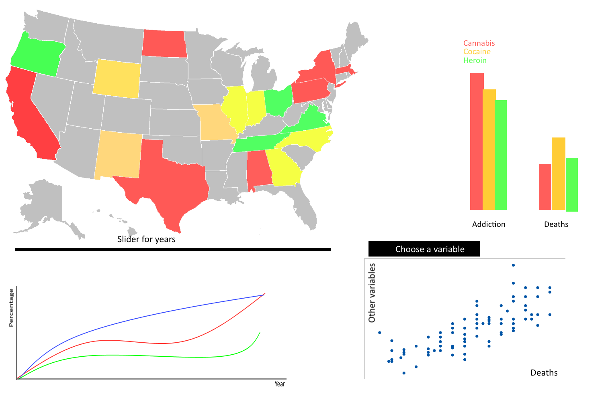

# Failure of the 'War on Drugs'
By Bas Kuiken

# Programming-Project summary
This repository holds a data-processing project for a course of the minor Programming. I intend to
create a visualization which shines some light on the failure of the 'War on Drugs'.

# Problem Statement
There is a widespread lack of knowledge on the 'War on Drugs'. The idea was to reduce drug-related
deaths and addictions and reduce criminal activity, by prioritizing drug offenses. Numbers show that
drug use has not dropped, neither have drug addiction and drug-related deaths. The visualization I
intend to build shows those numbers in an easy to grasp format.

# Solution
I want to show that an increase in drug-related arrests does not decrease drug use, addiction and
deaths.
Sketch:

Features:
-Users can see drug use by state on a map. A slider adjusts the year (also for grouped barchart, not
    MVP) and a vertical line in the line chart to show which year you're in. (MVP)
-Users can see drug-related deaths and addiction in a grouped bar chart and can choose which year it
    shows (not MVP)
-Users can see a line chart with drug-related arrests per year and DEA spending, with the lines
    showing different kinds of drug related arrests, second y axis showing amount of money (MVP).
-Scatterplot showing drug related deaths in the world on x-axis and on the y-axis a couple of
    interesting variables, chosen in a drop down (MVP).

# Prerequisites
-Drug abuse(http://datafiles.samhsa.gov/study-series/national-survey-drug-use-and-health-nsduh-nid13517)
-Drug use(http://datafiles.samhsa.gov/info/browse-studies-nid3454)
-Drug related arrests(http://www.drugwarfacts.org/table/total_arrests)
-Drug deaths(https://www.drugabuse.gov/related-topics/trends-statistics/overdose-death-rates,
    https://data.unodc.org/)

I need d3.js and Datamaps(datamaps.github.io)

There are graphs on the internet that show these numbers seperately, but there is no visualization
that combines these three/four visualizations.

I think transforming the data so it will be useful is going to be tricky. Coloring the map is
something new which I think might give me some headaches. With patience I think the transforming
could be not too big of a problem. The same goes for coloring the map. I also have never made a
grouped barchart, but I think tutorials will help me with that.
